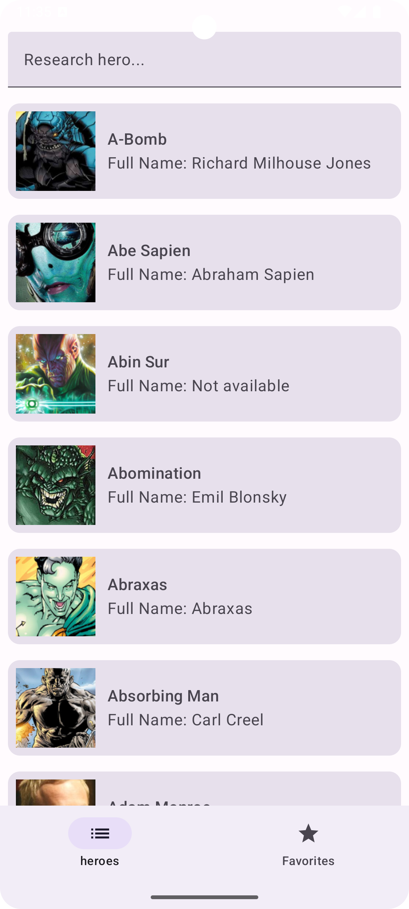
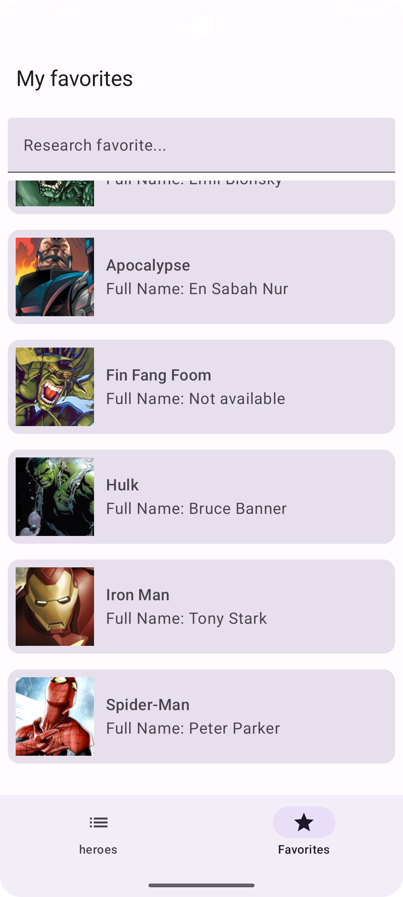
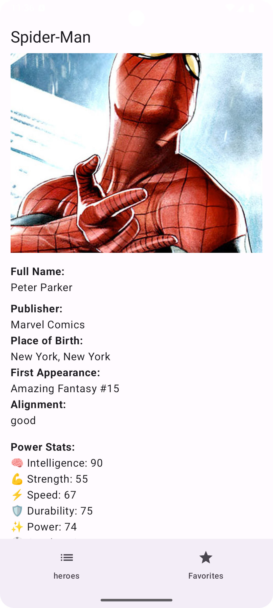

# 🦸 Marvel Heroes App

An Android application built with **Jetpack Compose**, allowing users to explore and save superheroes from the Marvel universe (and beyond) using the [Akabab Superhero API](https://akabab.github.io/superhero-api/api/).

## ✨ Features

- 🔍 Real-time search
- 📋 Hero list with names and images
- 🧾 Detailed hero screen including:
  - Full biography
  - Power stats
  - Physical appearance
- ⭐ Add/remove favorites (stored via Firebase Firestore)
- 🔄 Pull-to-refresh support
- 📤 Share hero info via Android share intent
- 💾 Offline persistence for favorites

---

## 📦 Tech Stack

| Technology        | Description                          |
|-------------------|--------------------------------------|
| Kotlin            | Main programming language            |
| Jetpack Compose   | Declarative UI framework             |
| Retrofit          | HTTP API client                      |
| Coil              | Asynchronous image loading           |
| Firebase Firestore| Cloud database for storing favorites |
| Navigation Compose| Screen navigation                    |

---

## 🔗 API Used

- [Akabab Superhero API](https://akabab.github.io/superhero-api/api/)
  - No authentication required
  - Rich dataset including hero images, power stats, biography, and more

---

## 🧪 Screenshots

<p float="left">
  
  
  
</p>

---

## 🚀 Getting Started

1. Clone this repository:
   ```bash
   git clone https://github.com/your-username/marvel-heroes-app.git
